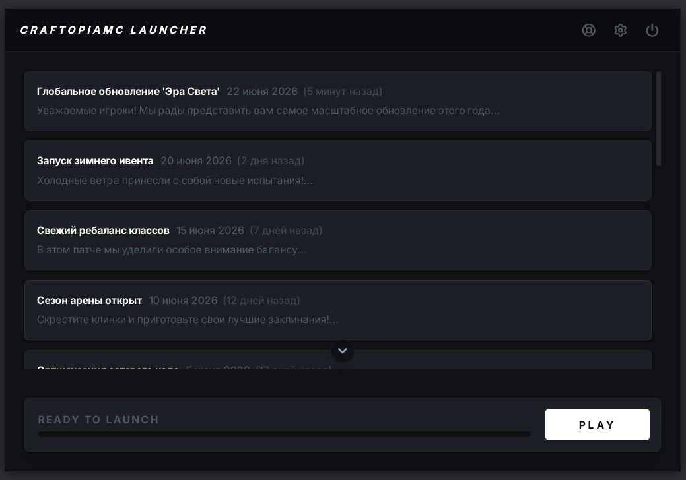
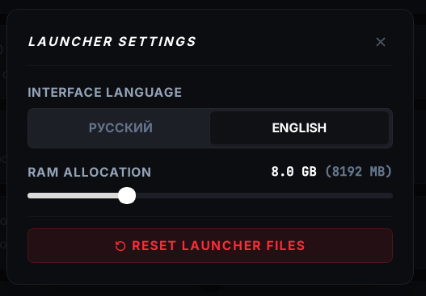

<div align="center">
  
  <h1 align="center">CraftopiaMC Launcher</h1>
  <p align="center">
    A lightweight, cross-platform Minecraft launcher built with <strong>Go + Wails v2 + React</strong>.
    <br />
    Downloads Java, Minecraft client + assets, Fabric Loader, synchronizes mods, and launches the game —
    all with a clean, modern UI and real-time progress tracking.
  </p>
  <p align="center">
    
    
    
    
    
  </p>
</div>

---

## Overview

CraftopiaMC Launcher is a desktop application that manages the entire Minecraft lifecycle —
from provisioning the Java runtime and downloading game assets to launching Minecraft with Fabric Loader
and keeping mods synchronized. Designed as a modern, minimal alternative to the official launcher.

**Key features:**
- **Automatic Java 25** — downloads Adoptium JRE if missing or corrupted
- **Full Minecraft provisioning** — client, libraries, assets, Fabric Loader, and Fabric dependencies
- **Mod syncing** — compares local `minecraft/mods/` against CDN manifest with SHA256 verification
- **Parallel downloads** — 16 concurrent workers for libraries and assets
- **SHA1/SHA256 integrity** — every file checked against official manifests
- **Infinite retry** — on network loss, retries the current file until success, never restarts the batch
- **Real-time progress** — percentage, speed, and translated status text
- **System tray** — auto-hides when Minecraft launches, re-appears when game exits
- **Settings persistence** — language (RU/EN) and RAM allocation saved via localStorage + settings.json
- **Custom branding** — passes launcher icon and version to Minecraft via JVM properties (requires Fabric branding mod)
- **One‑click reset** — clears all game data for a clean reinstall
- **Responsive window** — adapts from 640×480 to 4K displays
- **CI‑ready** — GitHub Actions build produces Linux and Windows binaries on every push

---

## Screenshots

| Launcher window | Active download |
|----------------|-----------------|
|  |  |

---

## Tech Stack

| Layer | Technology |
|-------|-----------|
| **Backend** | Go 1.25, Wails v2.12 |
| **Frontend** | React 19, TypeScript 5.8, Vite 6 |
| **Styling** | Tailwind CSS v4, CSS transitions |
| **Icons** | Lucide React |
| **System Tray** | energye/systray |
| **Minecraft Data** | Mojang version manifest API, Adoptium API, Maven Central |
| **CDN** | download.craftopiamc.org (file listing with SHA256 hashes) |
| **CI / CD** | GitHub Actions — builds Linux + Windows on push to `main` |

### Pipeline

```
Start → Java (0‑20%) → Minecraft + Fabric (20‑80%) → Mods (80‑95%) → Launch (95‑100%)
```

- Java       — downloads Adoptium JDK 25 if missing
- Minecraft  — fetches Mojang manifest, downloads client.jar, ~100 libraries, ~5000 assets
- Fabric     — downloads Fabric Loader from Maven, ASM 9.9, sponge‑mixin
- Mods       — syncs `minecraft/mods/` with CDN manifest, SHA256 verification
- Launch     — builds classpath, JVM args (G1GC tuned), launches KnotClient

---

## Building

### Prerequisites

```bash
# Go
go install github.com/wailsapp/wails/v2/cmd/wails@v2.12.0

# Linux
sudo apt install libgtk-3-dev libwebkit2gtk-4.1-dev libayatana-appindicator3-dev

# Windows cross‑compilation (from Linux)
sudo apt install gcc-mingw-w64-x86-64

# Node
cd frontend && npm install
```

### Build

```bash
./build.sh
```

Output in `compiled/`:
- `launcher` — Linux (x86_64)
- `launcher.exe` — Windows (x86_64)

---

## Project Structure

```
CraftopiaMC-Launcher/
├── app.go                    # Application logic, bindings, event handlers
├── main.go                   # Wails entry point
├── build.sh                  # Cross-platform build script
├── core/version.go           # Version string (injected via ldflags)
├── modules/
│   ├── DIRCHECK.go           # Directory structure enforcement
│   ├── INIT.go               # Path initialization, .desktop file
│   ├── JAVA.go               # Java download (Adoptium API)
│   ├── LAUNCH.go             # Minecraft launch (JVM args, classpath)
│   ├── LOGGER.go             # File logging
│   ├── MANIFEST.go           # Mojang manifest + path helpers
│   ├── MINECRAFT.go          # Minecraft / Fabric download
│   ├── MODS.go               # Mod sync from CDN
│   ├── SETTINGS.go           # Settings persistence + i18n
│   ├── TRAY.go               # System tray
│   └── sysinfo_*.go          # Platform RAM detection
├── frontend/
│   ├── src/App.tsx           # Root component (localStorage init)
│   ├── src/layouts/          # Desktop layout with settings modal
│   ├── src/pages/Play/       # Play page with progress + news
│   ├── src/contexts/         # RU/EN translation dictionary
│   └── src/store/            # Minimal state context
├── assets/appicon.png        # App icon (256x256)
├── screenshots/              # Screenshots for README
└── MODDER.md                 # Branding mod instructions
```

---

## Versioning

Versions are auto-generated at build time:

```
format: YYYY.M.D.HHmm
example: 2026.6.24.0105
```

Passed via `-ldflags "-X 'craftopiamc-launcher/core.AppVersion=$VERSION'"`.

---

## License

MIT — free to use, modify, and distribute.

---

<div align="center">
  <sub>Built with ❤️ for the CraftopiaMC community</sub>
</div>
